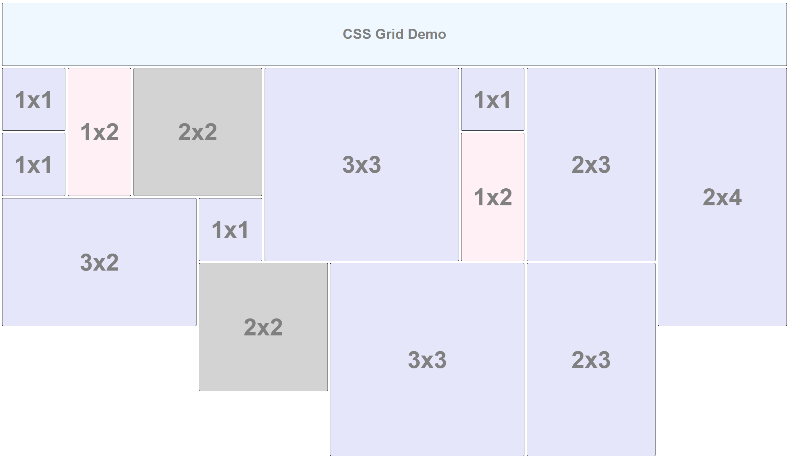

# Pure CSS Masonry-like grid

A responsive Masonry-like grid layout in pure CSS. For more info, see [my blog post](https://tomgrek.com/css-grid).



## Is this ready for prime time?

No, because it uses ```display: grid```. Latest news is that should be implemented in all significant browsers in *March 2017*.
